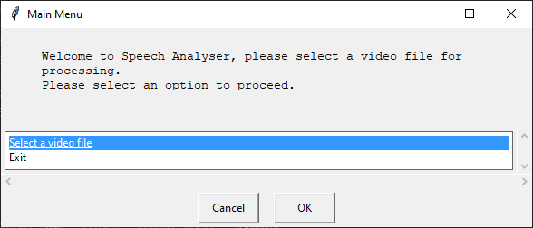
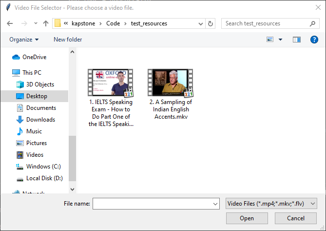
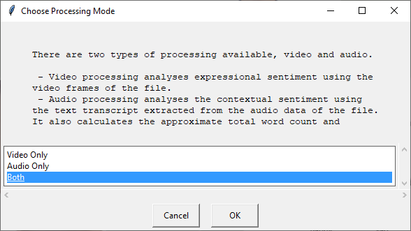
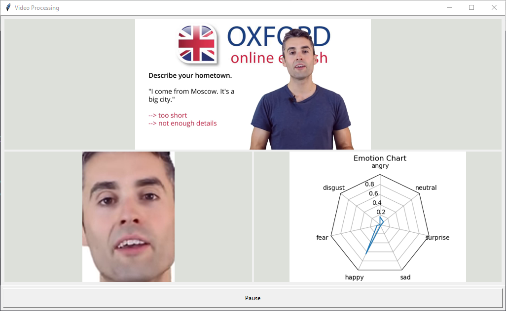
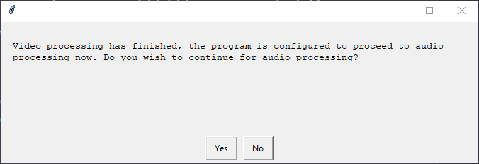
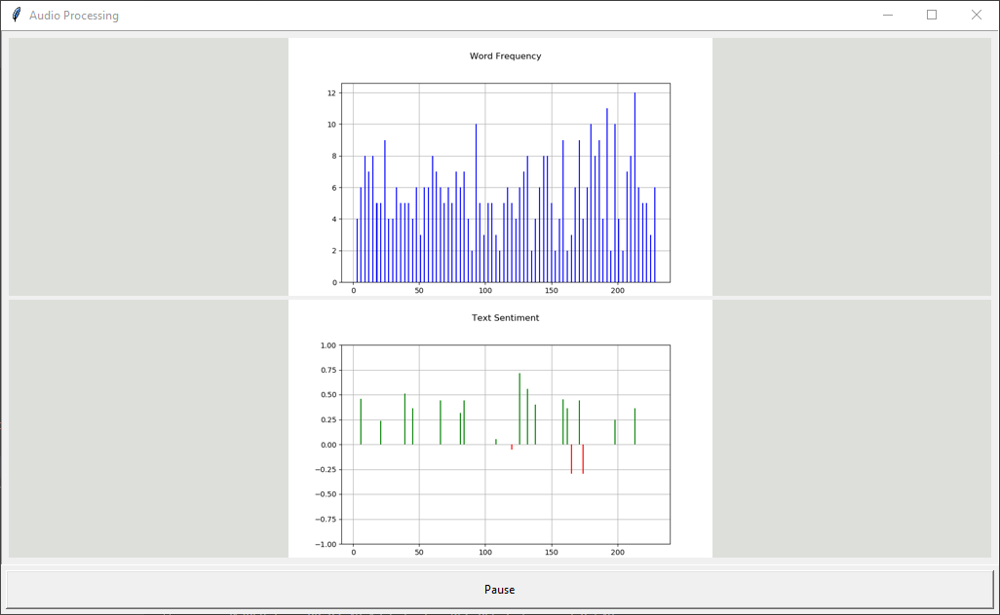
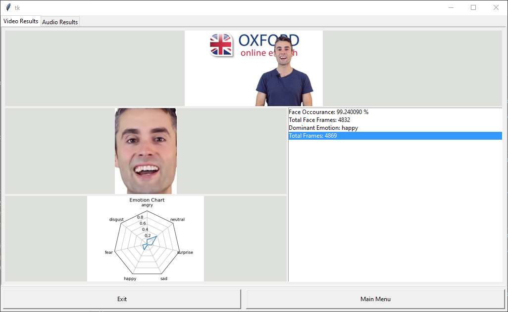
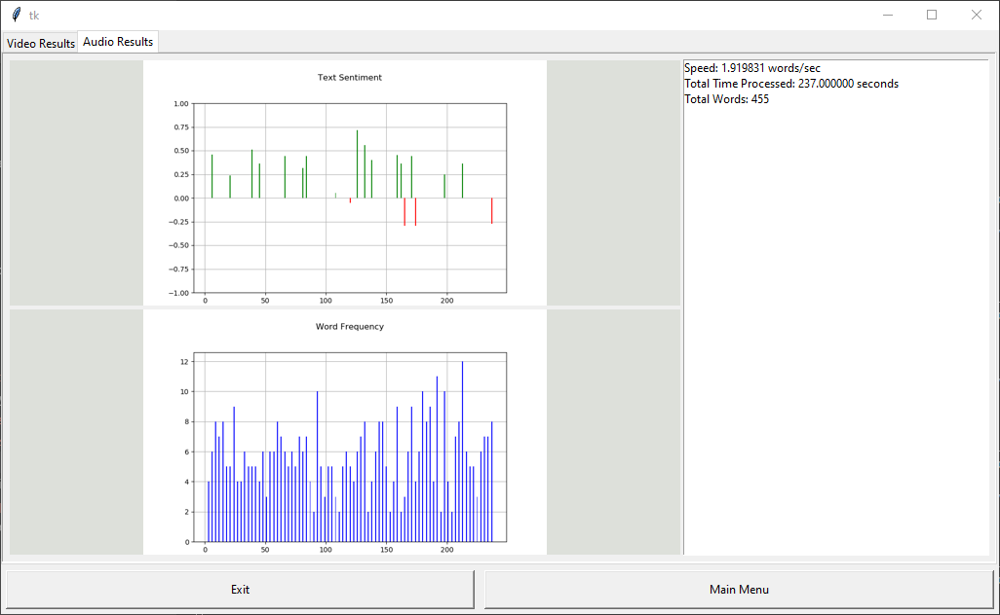
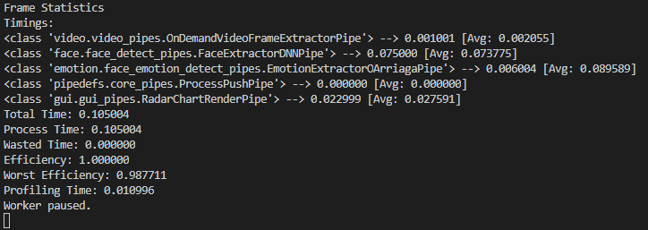
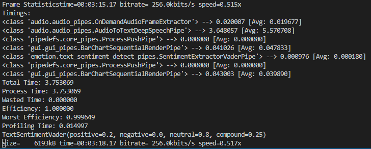

# CapstoneProject-LPU

## Program Output

The final GUI looks like this,

### Main Menu

### File Select

### File Confirmation

### Processing Mode Selection

### Video Processing

### Proceding Confirmation

### Audio Processing

### Final Result

### Console Log

#### Video Statistics

#### Audio Statistics

## Setup environment

> This code is super old and was created when I was still learning about python environments and AI. This means the deployment code might not work on modern versions of libraries. The core data handling code however is fine. If you want to submit a pull request to fix the deployment and dev-environment stuff feel free to do so.

- First install Anaconda form [> this link <](https://www.anaconda.com/distribution/).

- Clone this reposatory to a folder on your computer.

- To setup codding environment run `start.bat`.

      The script automatically sets up python and tensorflow in an anaconda environment called `kapstone`.

      ## Note
      The deployment is currently broken. Please run `main.py` instead and manually install the required dependencies when errors occour.

      Also, please manually download the required resources. The source links are available in the `README.md` files in the respective resource directory.

- After executed once, run `start.bat` again to open the Jupyter lab. Make new notebooks and files there as required.

> Jupyter lab is currently not used in the project since I am creating the infrastructure for the application.

> ### NOTE
> The project has switched to a custom GUI using `TKinter` and `easyGUI` instead of using Jupyter lab. Run [`main.py`](./Code/main.py) in your conda environment.

If you want to develop, open the `Code` folder in your IDE as all files assume that `Code` is the root folder. This top level folder is only used to bundle `Code` and `deployment` folders.
