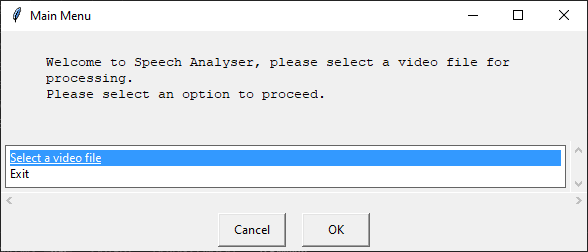
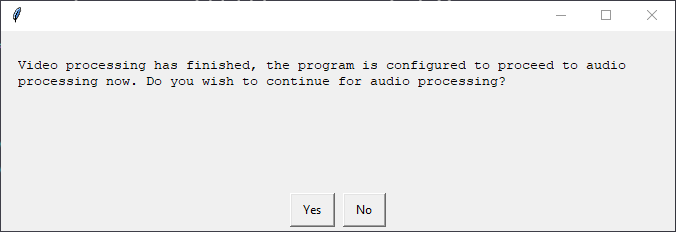
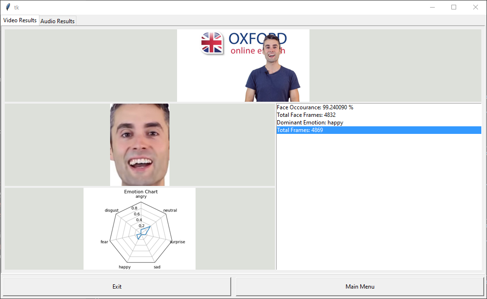
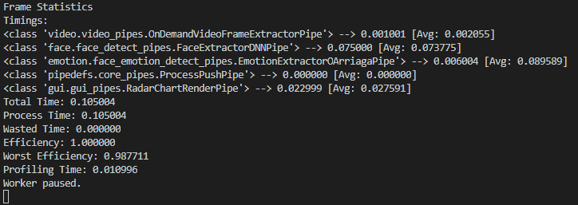
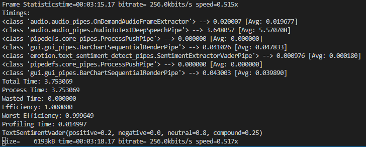

# Program Output

The final GUI looks like this,

## Main Menu

## File Select

## File Confirmation

## Processing Mode Selection

## Video Processing

## Proceding Confirmation

## Audio Processing

## Final Result

## Console Log

### Video Statistics

### Audio Statistics

